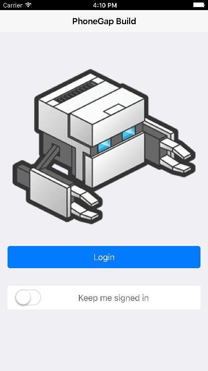
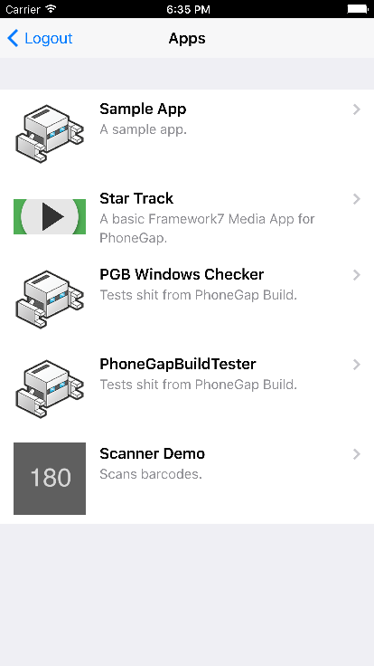
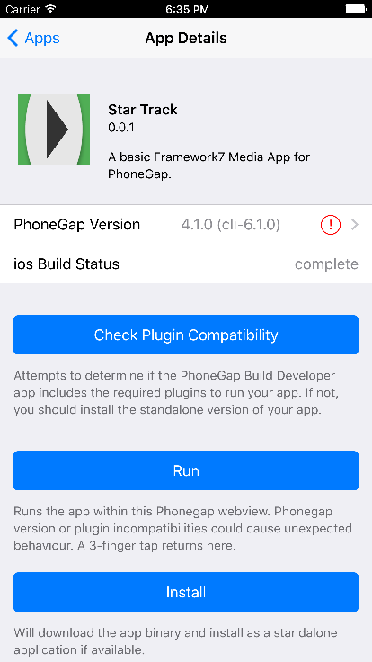

# PhoneGap Build Developer App

## What it does

Log into PhoneGap Build, view and run your PGB apps within the same webview, or optionally install them individually.

## Can I build it on PhoneGap Build?

Unfortunately, not at the moment (it will build, but you can't yet inject plugin params into code files with plugman -- [jira issue](https://issues.apache.org/jira/browse/CB-11859)).

## Build & Run Locally

Install phonegap if you haven't already

    npm install -g phonegap@6.0.3

Clone the repo and add platforms

    git clone http://github.com/phonegap/phonegap-app-pgb.git
    phonegap platform add ios
    phonegap platform add android

Obtain API oauth client credentials (a `CLIENT_ID` and `CLIENT_SECRET`) from [PhoneGap Build](https://build.phonegap.com/people/edit). Add the credentials to the PGB Oauth Plugin for Android (platforms/android/src/com/phonegap/build/oauth/PhonegapBuildOauth.java line 25) and iOS (`platforms/ios/PhoneGap\ Build/Plugins/com.phonegap.build.oauth/CDVPhonegapBuildOauth.m` line 13).

Compile and Run

    phonegap run ios
    phonegap run android

## Screenshots

    
